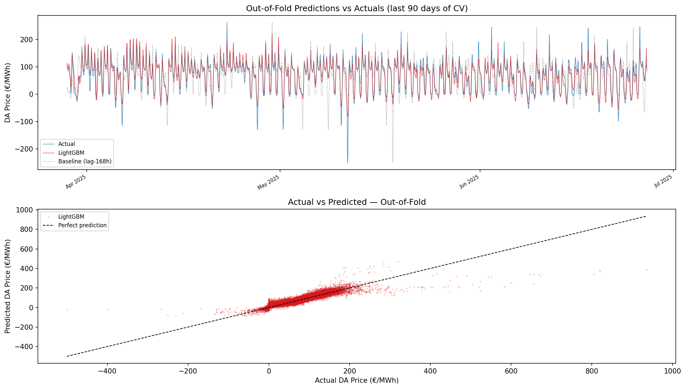
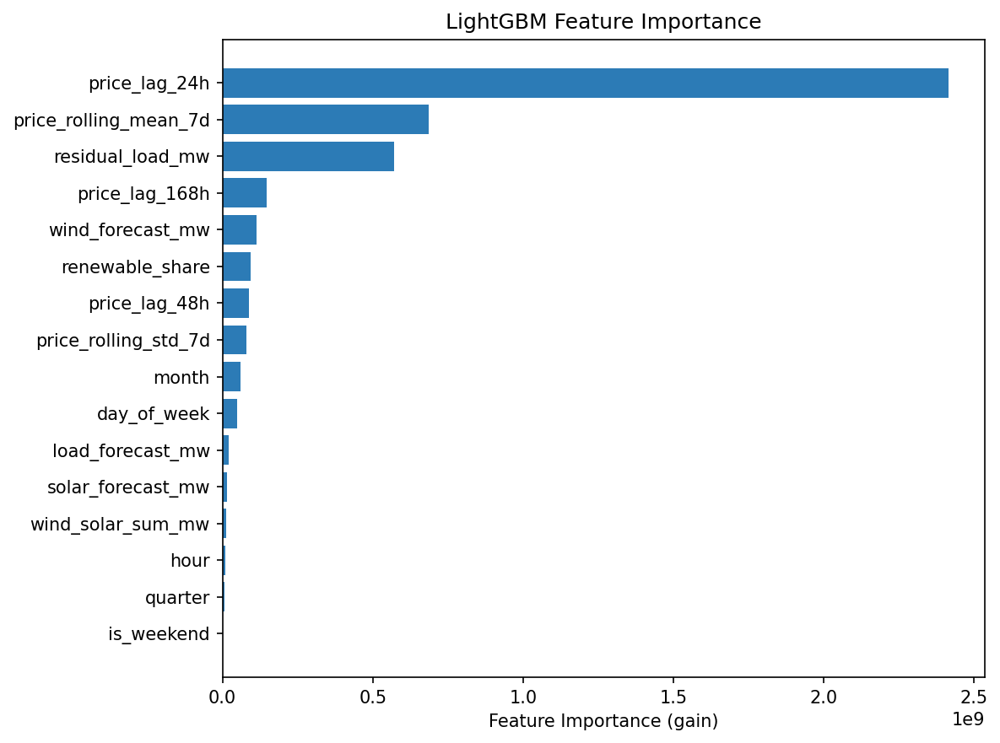
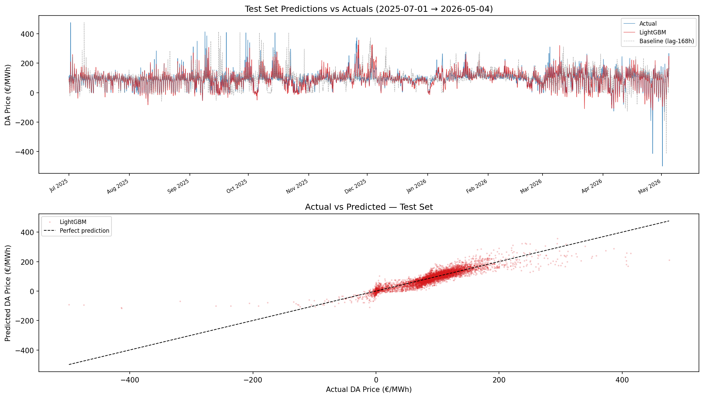
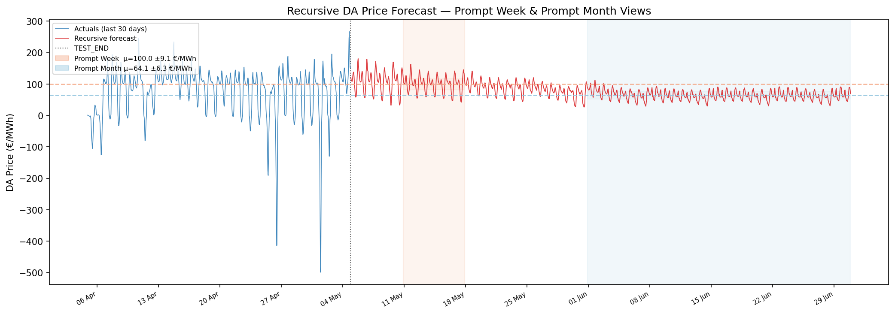

# German Power Day-Ahead Price Forecasting — Case Study Report

**Mohamad Fares**  
fares.mohamad1602@gmail.com

---

## Part 1 — Data Ingestion and Quality

### Market and Data Source

Germany (DE_LU) was chosen as the target market: largest European power market by volume, most complete ENTSO-E coverage, price dynamics dominated by wind and solar — the cleanest publicly available fundamental drivers. All data was sourced from the [ENTSO-E Transparency Platform REST API](https://documenter.getpostman.com/view/7009892/2s93JtP3F6) via the `entsoe-py` Python client. Full endpoint documentation in `docs/api_endpoints.md`.

Five series were collected at hourly resolution:

| Series | ENTSO-E Article | Role |
|---|---|---|
| Day-Ahead prices | 12.1.D | Target variable |
| DA wind and solar forecast | 14.1.D | Primary supply driver |
| DA load forecast | 6.1.B | Primary demand driver |
| Actual wind and solar generation | 16.1.B&C | Training features (not used at inference) |
| Actual total load | 6.1.A | Training features (not used at inference) |

Training window: **2021-01-01 → 2025-06-30**. Test window: **2025-07-01 → yesterday** (dynamic). All series except DA prices are published at 15-minute resolution and resampled to hourly means in the merge layer. DA prices transitioned to 15-minute settlement in October 2025; the same resampling step handles both resolutions. Requests are issued in 90-day chunks to stay within the API's response size ceiling. The fetcher retries each chunk up to 3 times with exponential backoff; a chunk that fails all attempts raises an error rather than silently saving a gap. Despite this, the exact dataset fetched on any given run may differ marginally due to transient ENTSO-E API errors (e.g. 503s) that are outside pipeline control.

### Timezone and DST Handling

All pipeline boundary timestamps are defined as `tz="Europe/Berlin"` so that transitions are unambiguous at the API query level. Three DST-specific concerns are handled explicitly:

- **Spring forward (23-hour day, late March):** ENTSO-E does not publish a row for the missing 02:00–03:00 hour. No special handling is needed — the merge index simply has no entry for that UTC slot.
- **Fall back (25-hour day, late October):** `entsoe-py` returns a UTC DatetimeIndex, so the two Berlin "02:00" occurrences on a fall-back day are stored as two distinct UTC timestamps (`00:00 UTC` and `01:00 UTC`) — both are correctly preserved.
- **Join alignment:** All series are converted to UTC before the left-join on the price index. This eliminates DST ambiguity at the join level. A `timestamp_local` (Europe/Berlin) column is preserved separately as the source for calendar features, ensuring that hour-of-day, day-of-week, and month features reflect Berlin local time rather than UTC offsets.

QA verified 6 correct 23-hour days (March) and 5 correct 25-hour days (October) across the full dataset.

### Data Quality

35 automated checks were run on both the raw and cleaned datasets (`src/qa/`). Reports at `data/qa/qa_report.md` and `data/qa/qa_report_clean.md`. After cleaning, **all 35 checks passed**. Checks span five categories: structural (monotonicity, frequency, required columns), missingness (per-column NaN counts and max gap lengths), duplicates (UTC uniqueness, DST day-length verification), value sanity (physical bounds, nighttime solar), and cross-series (forecast bias by year, negative price hours, renewable surplus hours).

**Findings on the raw dataset:**
- 1,730 hours of negative DA prices across the full dataset — physically valid (excess renewable supply), not treated as outliers
- 547 hours where wind + solar forecast exceeded total load — valid renewable surplus events
- `solar_forecast_mw`: 3 NaN (critical failure in raw QA), max gap 1 hour
- `load_forecast_mw`: 50 NaN (critical failure in raw QA), max gap 24 hours
- `wind_forecast_mw`, `da_price_eur_mwh`: complete, 0 NaN
- `solar_actual_mw`: 9 NaN (0.019%), max gap 9 hours — actuals only, not a model input
- `load_actual_mw`: 8 NaN (0.017%), max gap 8 hours — actuals only, not a model input

**Cleaning:**
53 cells were imputed across 2 forecast columns using **time-based linear interpolation** (72-hour max gap limit). This is more physically defensible than forward-fill for multi-hour gaps: it fits a straight line between the bounding known values, weighted by actual elapsed time. Full cell-level log: `data/qa/impute_log.json`.

- `solar_forecast_mw`: 3 cells — one missing midnight reading on each of three DST fall-back dates (Oct 2023, Oct 2024, Oct 2025). Adjacent values were both 0 MW, so interpolation correctly produced 0.
- `load_forecast_mw`: 50 cells — two full-day ENTSO-E reporting outages (2022-02-22 and 2022-03-24, 24 hours each), plus two DST fall-back midnight readings (Oct 2023, Oct 2024). Interpolation produced a smooth load ramp across the outage windows, consistent with the slow drift of hourly load forecasts.

No imputation was applied to the target variable (`da_price_eur_mwh`) or to actual-generation columns, which are used for QA cross-checks only and not as model inputs.

---

## Part 2 — Forecasting and Model Validation

### Forecasting Approach

Option A was chosen: forecast next-day hourly DA prices, then aggregate to prompt-week and prompt-month delivery averages. Option B (forecasting delivery-period averages directly) was ruled out because multi-week-ahead wind, solar, and load forecasts are not publicly available — the aggregate inputs would be weak. Under Option A, ENTSO-E publishes DA-horizon forecasts for all three drivers one day ahead, which are clean and directly usable as features. The weekly and monthly views emerge naturally from aggregating the daily predictions rather than being estimated from noisier aggregate inputs.

### Feature Engineering

16 features are used, grouped into three families:

| Group | Features |
|---|---|
| Fundamental drivers | `wind_forecast_mw`, `solar_forecast_mw`, `load_forecast_mw`, `residual_load_mw`, `wind_solar_sum_mw`, `renewable_share` |
| Lagged prices | `price_lag_24h`, `price_lag_48h`, `price_lag_168h` |
| Rolling price stats | `price_rolling_mean_7d`, `price_rolling_std_7d` |
| Calendar | `hour`, `day_of_week`, `month`, `quarter`, `is_weekend` |

**Leakage policy:** DA prices for day D are published at 12:55 CET on D-1. All price lag features use a minimum shift of 24 hours, and rolling statistics are computed on the 24h-shifted series before the rolling window — so the window never touches the delivery day. DA forecasts are published alongside auction results and are safe to use directly.

**Derived features:** `residual_load_mw` (load minus wind and solar) directly captures the volume of gas-fired generation required to clear the market — the primary marginal price determinant. `renewable_share` adds a normalised penetration measure that carries signal independently of the raw MW values.

### Baseline

The baseline predicts each delivery hour's price as the actual price observed at the same hour exactly one week earlier (`price_lag_168h`). This is a strong benchmark for power prices because weekly seasonality is one of the dominant patterns: weekday morning peaks recur, weekend troughs recur, and fuel costs drift slowly. Any model that fails to beat it materially is not adding value.

### LightGBM Model

A `LGBMRegressor` with L2 regression objective, MAE early-stopping metric (patience 50), `n_estimators=1000`, `learning_rate=0.05`, `num_leaves=63`, `subsample=0.8`, `colsample_bytree=0.8`, L1/L2 regularisation 0.1. Early stopping uses each fold's validation set; the final model trains on the full training set without early stopping.

**Walk-forward cross-validation:** expanding-window design, 30 folds, 2-year minimum initial window, 720-hour (~1 month) validation steps. The training window grows each fold and never resets. Random splits were not used — they would allow the model to see future prices when predicting past ones, producing optimistically biased metrics.

### Performance

| Evaluation window | Model | MAE (€/MWh) | RMSE (€/MWh) | Tail MAE (€/MWh) |
|---|---|---|---|---|
| CV OOF aggregate (2023-01-08 → 2025-06-26, 30 folds) | Baseline | 33.23 | 51.17 | 58.12 |
| CV OOF aggregate (2023-01-08 → 2025-06-26, 30 folds) | LightGBM | 15.21 | 24.33 | 28.04 |
| Test set (2025-07-01 → 2026-05-04) | Baseline | 32.97 | 51.04 | 72.98 |
| Test set (2025-07-01 → 2026-05-04) | LightGBM | 15.06 | 23.42 | 28.91 |

The OOF aggregate stacks all 30 folds as one, more conservative than averaging per-fold MAEs. LightGBM reduces MAE by 54% on both the CV period and the held-out test set, confirming the improvement generalises. The tail MAE (top and bottom 5% of actuals — spikes and negative hours) follows the same pattern: 28 €/MWh vs. 58–73 €/MWh for the baseline, which matters most for trading.

**Submission:** `outputs/predictions/submission.csv` — columns `id` (UTC), `timestamp_berlin`, `y_pred` (€/MWh), covering 2025-07-01 → 2026-05-04.

**Feature importance and limitations:** `price_lag_24h` accounts for 55.3% of gain, `price_rolling_mean_7d` 15.7%, `residual_load_mw` 13.1%. The model is lag-dominated, which explains its strong same-day performance but creates compounding uncertainty in the recursive multi-step forecast: each predicted price feeds the next step's lag features, so errors accumulate. The weekly and monthly averages carry wider uncertainty than first-day predictions — reflected in the sigma bands in Part 3. Full per-fold results: `outputs/reports/model_performance.md`.

---

## Part 3 — Prompt Curve Translation

### Recursive Forecast and Period Aggregation

The final model is applied recursively from `TEST_END + 1h` through the end of the prompt month. Beyond the 24-hour horizon, ENTSO-E forecasts are unavailable, so driver inputs use **climatological proxies** — training-set means grouped by `(month, hour-of-day)`. A price buffer seeded with the last 200 actuals grows as each prediction is appended, feeding lag and rolling features at each step. Hourly predictions are averaged within each delivery window (Prompt Week: next full ISO Mon–Sun; Prompt Month: next full calendar month).

### Uncertainty Model

Sigma is derived from OOF residuals resampled to delivery-period frequency (weekly or monthly). The standard deviation of those period-mean residuals captures the typical error of a **period-average** forecast — the quantity relevant for delivery-period trading. CIs: ±1.28σ (80%), ±1.96σ (95%).

Current fair-value estimates (model data through 2026-05-04):

| Period | Dates | Fair Value (€/MWh) | σ (€/MWh) | 80% CI | 95% CI |
|---|---|---|---|---|---|
| Prompt Week | 2026-05-11 → 2026-05-17 | 100.02 | 9.13 | [88.33, 111.70] | [82.12, 117.91] |
| Prompt Month | 2026-06-01 → 2026-06-30 | 64.10 | 6.26 | [56.09, 72.12] | [51.83, 76.38] |

### Desk Translation

The edge (fair value minus forward price) is expressed in sigma-multiples to normalise for period-specific uncertainty. Confidence tiers determine position sizing:

| Confidence | Threshold | Sizing |
|---|---|---|
| High | ≥ 1.96σ | Full size |
| Moderate | 1.28σ – 1.96σ | Half size |
| Low | 0.50σ – 1.28σ | Quarter size — indicative only |
| Noise | < 0.50σ | Flat |

A positive edge (fair value above forward) generates a long on the EEX baseload forward; negative edge generates a short. Example: at a 76 €/MWh prompt-week forward, edge = +24 €/MWh (+2.6σ) → full-size long. If edge falls below 0.5σ, no position is taken. Full three-scenario outputs: `outputs/reports/prompt_curve_view.md`.

### Invalidation Conditions

Any of the following would materially impair the fair-value estimate:

- **Weather surprise:** load or renewable output outside the climatological range used as proxies for the multi-week horizon.
- **Nuclear outage:** a surprise outage in Germany or France shifts the supply stack in ways the model's features do not capture.
- **Gas repricing:** a TTF spike lifts the marginal cost of gas-fired generation above model assumptions.
- **Regime shift:** sigma bands are calibrated on 2023–2025 OOF residuals; a structural market change would cause uncertainty to be underestimated.
- **Demand response:** large-scale industrial curtailment not reflected in the ENTSO-E load forecast suppresses realised demand below model inputs.

---

## Part 4 — AI-Accelerated Workflow

### Component: Automated Daily Market Commentary

The AI component is an automated market commentary generator (`src/ai/commentary.py`, `scripts/09_drivers_commentary.py`). It reads five pipeline output files, builds a structured prompt from computed metrics, calls the Anthropic API, and writes a four-section desk-ready narrative to `outputs/reports/drivers_commentary.md` — replacing the manual task of reading five separate files, computing driver changes, and writing a summary.

### What the LLM Receives

The prompt is assembled entirely from computed pipeline outputs with no manual input:

| Input file | What is injected |
|---|---|
| `outputs/tables/cv_metrics.csv` | Mean MAE, RMSE, tail MAE for LightGBM and baseline; improvement % |
| `outputs/tables/curve_views.json` | Fair value, sigma, 80%/95% CIs for each delivery period |
| `outputs/tables/prompt_curve_view.json` | Edge, σ-multiple, signal direction, confidence, and desk action for all three scenarios |
| `data/processed/features.parquet` | Climatological proxy driver values (wind/solar/load/residual load/renewable share) for each period, plus 30-day recent actuals |
| `outputs/tables/feature_importance.csv` | Per-feature importance share (% of total gain) |

Period-over-period driver changes are computed in Python and injected as formatted numbers — the LLM is never asked to do arithmetic.

### Hallucination Prevention

The prompt instructs the model explicitly: *"Use ONLY the numbers provided. Do not invent, estimate, or interpolate any figures not listed here."* Every number that appears in the commentary is a value that was injected from a verified pipeline output. The model's role is narrative synthesis, not calculation.

The LLM produces four sections: Model Quality, Fair Value View, Trading Signals, and Key Risks — each with a plain-language summary and supporting detail.

### Logging and Auditability

Every API call is appended to `outputs/logs/llm_calls.jsonl` with `timestamp`, `model`, `status`, `latency_ms`, `input_tokens`, `output_tokens`, full `prompt`, and full `response`. Failed calls log the exception with `response: null`. The log is append-only. The Anthropic API key is loaded from `.env` via `python-dotenv` — absent from all committed files. Sample call: `status=success`, `latency_ms=42,515`, `input_tokens=2,391`, `output_tokens=2,048`, `model=claude-sonnet-4-6`.
